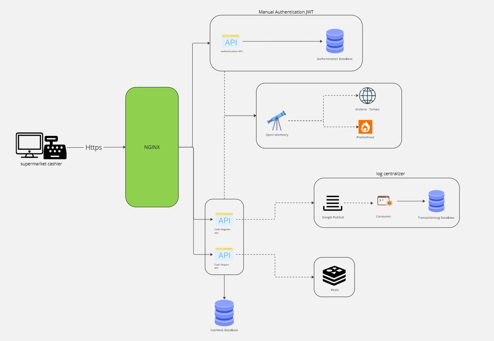

# Arquitetura do cash.hub

## 📌 Índice
- [Visão Geral](#visao-geral)
- [Componentes da Arquitetura](#componentes-da-arquitetura)
  - [NGINX (Reverse Proxy)](#nginx-reverse-proxy)
  - [Authentication API](#authentication-api)
  - [Authentication Database (SQL Server)](#authentication-database-sql-server)
  - [Google Pub/Sub (Message Broker para Logs)](#google-pubsub-message-broker-para-logs)
  - [Consumer de Logs](#consumer-de-logs)
  - [TransactionLog Database](#transactionlog-database)
  - [Redis (Cache para Relatórios)](#redis-cache-para-relatorios)
  - [Monitoring Stack](#monitoring-stack-opentelemetry-prometheus-grafana-tempo)
- [Fluxo da Arquitetura](#fluxo-da-arquitetura)
- [Benefícios da Arquitetura](#beneficios-da-arquitetura)
- [Diagrama da Arquitetura](#diagrama-da-arquitetura)
- [Como Rodar as APIs](#como-rodar-as-apis)

---

<a id="visao-geral"></a>
## 📜 Visao Geral
A arquitetura do **cash.hub** foi projetada para oferecer **segurança, escalabilidade e monitoramento** eficiente dos serviços financeiros. O sistema implementa autenticação JWT, mensageria para logs e uma stack de observabilidade.

## 🏗️ Componentes da Arquitetura

<a id="nginx-reverse-proxy"></a>
### 🔹 **NGINX (Reverse Proxy)**
- Atua como gateway de entrada, recebendo requisições HTTPs.
- Encaminha chamadas para os serviços adequados.
- Implementa Rate Limiting para evitar abusos.
- Obs: NGINX não foi colocado no compose mas está no desenho da arquitetura original

<a id="authentication-api"></a>
### 🔹 **Authentication API**
- Responsável por autenticação e geração de tokens JWT.
- Conecta-se ao **Authentication Database** (SQL Server) para validar usuários.
- Tokens possuem expiração de **60 minutos**.
- No futuro, pode ser substituído por **Keycloak** para uma autenticação mais robusta.

<a id="authentication-database-sql-server"></a>
### 🔹 **Authentication Database (SQL Server)**
- Armazena credenciais de usuários de forma segura.
- Senhas são **hashadas** para maior proteção.

<a id="google-pubsub-message-broker-para-logs"></a>
### 🔹 **Google Pub/Sub (Message Broker para Logs)**
- Processa logs de eventos de forma assíncrona.
- Evita sobrecarga direta no banco de dados.
- Envia logs para o **Consumer** processá-los antes de armazenar.
- Obs: Devido ao curto tempo, não consegui implementar essa solução.

<a id="consumer-de-logs"></a>
### 🔹 **Consumer de Logs**
- Processa mensagens do **Google Pub/Sub**.
- Insere logs no **TransactionLog Database**.

<a id="transactionlog-database"></a>
### 🔹 **TransactionLog Database**
- Armazena logs processados.
- Facilita consultas e auditorias de eventos.

<a id="redis-cache-para-relatorios"></a>
### 🔹 **Redis (Cache para Relatorios)**
- Utilizado para otimizar a consulta de relatórios na **CashHub Report API**.
- Reduz a carga no banco de dados armazenando consultas frequentemente acessadas.

<a id="monitoring-stack-opentelemetry-prometheus-grafana-tempo"></a>
### 🔹 **Monitoring Stack (OpenTelemetry, Prometheus, Grafana Tempo)**
- **OpenTelemetry** coleta métricas e traces.
- **Prometheus** armazena e processa métricas de desempenho.
- **Grafana Tempo** exibe dashboards para análise de traces e alertas.
- Inicialmente, a configuração estava no Docker Compose, mas automatizá-la se mostrou complexa. Para evitar perda de tempo, optei por não incluí-la no ambiente. No entanto, vale ressaltar que as APIs já estão preparadas para exportar traces e métricas, uma exigência essencial em um ambiente de microsserviços.

<a id="fluxo-da-arquitetura"></a>
## 🔗 Fluxo da Arquitetura
1. O **Caixa** precisa fazer um lançamento de **débito ou crédito**.
2. Para acessar a **Cash Register API**, ele precisa se autenticar.
3. O caixa envia credenciais para a **Authentication API**, que valida no **Authentication Database** e gera um **token JWT**.
4. O token JWT é usado para acessar a **Cash Register API**, garantindo que apenas usuários autenticados possam fazer lançamentos.
5. Logs da autenticação e transações são enviados para **Google Pub/Sub**.
6. O **Consumer** processa logs e armazena no **TransactionLog Database**.
7. O **Monitoring Stack** analisa métricas e traces em tempo real.
8. O **Redis Cache** é utilizado para armazenar consultas de relatórios frequentemente acessadas pela **CashHub Report API**, reduzindo a carga no banco.

📌 *Nota:* Houve a intenção de utilizar **Keycloak** para autenticação, mas devido ao curto prazo, foi implementado JWT manualmente. Futuramente, a adoção do Keycloak pode centralizar e aprimorar a autenticação.

<a id="beneficios-da-arquitetura"></a>
## 📌 Beneficios da Arquitetura
✅ Maior segurança com autenticação JWT e senhas hashadas.
✅ Desacoplamento de logs através de Google Pub/Sub e Consumer.
✅ Monitoramento completo com OpenTelemetry, Prometheus e Grafana Tempo.
✅ **Cache de relatórios com Redis**, reduzindo consultas repetitivas ao banco de dados.

<a id="diagrama-da-arquitetura"></a>
## 🖼️ Diagrama da Arquitetura


<a id="como-rodar-as-apis"></a>
## 🚀 Como Rodar as APIs

1. **Clonar o repositório**:
   ```sh
   git clone https://github.com/kadubezas/cash-hub.git
   cd cash-hub
   ```

2. **Subir os containers do SQL Server e Redis via Docker Compose**:
   - Os arquivos do **docker-compose** estão na pasta `Config`.
   ```sh
   docker-compose -f Config/docker-compose.yml up -d
   ```

3. **Executar as APIs**:
   ```sh
   dotnet run --project cash.hub/src/cash.hub.authentication.api
   dotnet run --project cash.hub/src/cash.hub.register.api
   dotnet run --project cash.hub/src/cash.hub.report.api
   ```

4. **Acessar os endpoints** via Swagger:
   - `http://localhost:5066/swagger`
   - `http://localhost:5231/swagger`
   - `http://localhost:5219/swagger`

